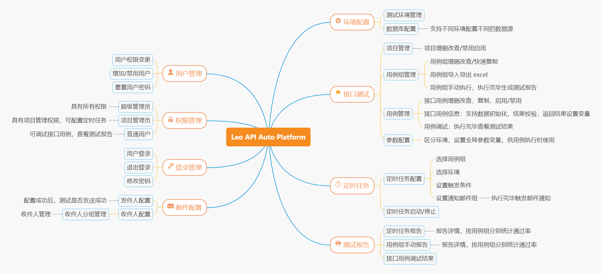

# leo API Test Platform

## Ⅰ. LEO API测试平台简介

「LEO API测试平台」是一个免费开源的接口自动化测试平台。

**推荐使用 Chrome 最新浏览器使用~**

## Ⅱ. LEO API测试平台功能结构
 

## Ⅲ .LEO API测试平台操作教程

TODO

## IV . LEO API测试平台部署
[点击进入部署教程](tutorial/deploy.md)
