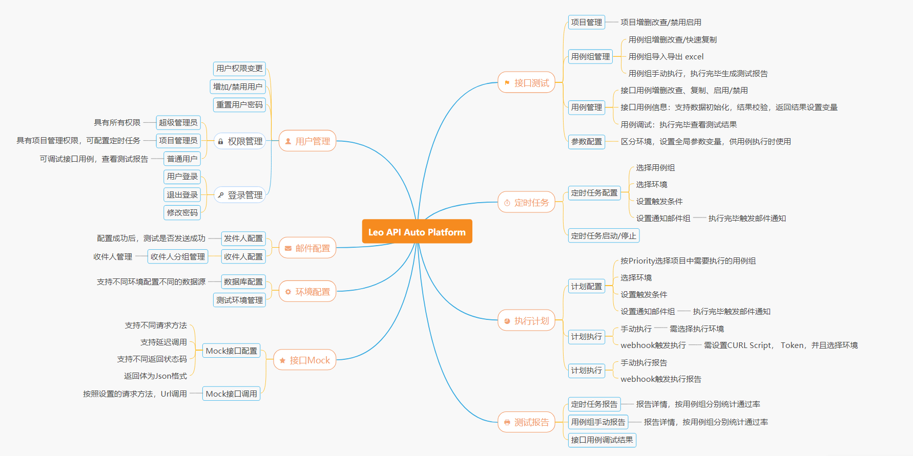

# leo API Test Platform

## Ⅰ. LEO API测试平台简介

「LEO API测试平台」是一个免费开源的接口自动化测试平台。

1. 既支持单个接口测试，也支持基于场景的接口测试用例，接口可串联执行，实现了接口间的数据依赖。
2. 平台支持多个测试环境共用同一套接口测试用例
3. 测试数据与测试用例分离，可根据环境设置不同测试数据，不同环境数据互不影响
4. 平台支持定时任务功能，可设置定时任务，自动执行接口用例
5. 简单、美观、易用的接口测试报告
6. 平台支持权限管理，不同用户权限不同，避免普通用户随意变更敏感信息造成数据损坏
7. ...更多功能...敬请期待...

**推荐使用 Chrome 最新浏览器体验**

## Ⅱ. LEO API测试平台功能结构

## Ⅲ. LEO API测试平台操作教程

[点击进入操作教程](tutorial/tutorial.md)

## IV. LEO API测试平台部署

[点击进入部署教程](tutorial/deploy.md)

## V. LEO 平台交流

QQ群号： 617352502

[点击链接或扫描下方二维码添加QQ群](https://qm.qq.com/cgi-bin/qm/qr?k=SB0KIsQN7F4gGKl5UTdiedOztjtOlLqo&jump_from=webapi)

