### 4_接口测试
接口测试用例管理分3个层级。
1. 项目级别: 项目信息 包括项目名称，版本号，描述，状态等信息  
   进入项目后，可以管理项目包含的接口用例组、全局参数设置、设置定时任务、查看测试报告等
2. 用例组级别: 用例组信息 包括用例组名称，优先级， 描述， 所属服务， 状态 等信息
   进入接口用例组后，可以管理 用例组接口用例
3. 接口用例级别: 接口用例信息 包括 接口名称，Method，Request URL，数据初始化信息，Headers，Request Parameter，设置变量， 结果校验等

#### 4.1 项目管理
只有超级管理员 和 项目管理员 有**项目管理**权限。  
管理员账号登录后，点击左侧 Menu **接口测试** 进入项目管理页面
##### 4.1.1 添加项目
1. 进入**项目管理**页面后，点击 **新增项目**  
2. 输入 项目 名称、版本号、描述 信息  
3. 点击 **提交** 保存项目信息  
##### 4.1.2 编辑项目
1. 进入 **项目管理** 页面后，页面会展示 项目列表
2. 可以在页面左上角 进行查询，查询条件为 项目名称，支持模糊查询
3. 选择要编辑的 项目，点击右侧 **编辑** 按钮
4. 输入 要修改的 名称/版本号/描述 信息
5. 点击 **提交** 保存项目信息
##### 4.1.3 删除项目
1. 进入 **项目管理** 页面后，页面会展示 项目列表
2. 可以在页面左上角 进行查询，查询条件为 项目名称，支持模糊查询
3. 选择要编辑的 项目，点击右侧 **删除** 按钮
4. 点击 弹出框的 **确认** 按钮， 删除项目
5. *误操作删除项目可以找管理员直接修改DB，找回项目*
##### 4.1.4 禁用/启用项目
1. 进入 **项目管理** 页面后，页面会展示 项目列表
2. 可以在页面左上角 进行查询，查询条件为 项目名称，支持模糊查询
3. 选择要禁用的 项目，点击右侧 **禁用** 按钮（如果状态为禁用，则按钮为 **启用**），即可禁用/启用 项目

#### 4.2 用例组管理
所有用户都 有**用例组管理**权限。   
用例组信息包括  

       必填项: 用例组名称、优先级(P1 or P2)   
       非必填项: 描述、 所属服务、Sprint(如果项目为敏捷模式，可记录该需求所属Sprint)、  
            StoryId(记录接口需求的Story ID)、TestCaseId(记录测试用例的TestCaseID)、状态(默认启用) 等信息
1. 进入 **项目管理** 页面后，页面会展示 项目列表
2. 可以在页面左上角 进行查询，查询条件为 项目名称，支持模糊查询
3. 点击项目名称 会进入该项目内的 **接口用例组列表**页面 
##### 4.2.1 添加/编辑用例组
1. 进入 **接口用例组列表**页面， 点击 左上角 **新增用例组** 按钮可以添加用例组
2. 可以在页面右上角 进行查询，查询条件为 用例组名称，支持模糊查询
3. 选择要编辑的 用例组，点击右侧 **编辑** 按钮， 可以编辑用例组
##### 4.2.2 禁用/启用用例组
1. 进入 **接口用例组列表**页面
2. 可以在页面右上角 进行查询，查询条件为 用例组名称，支持模糊查询
3. 选择要禁用的 用例组，点击右侧 **禁用** 按钮（如果状态为禁用，则按钮为 **启用**），即可禁用/启用 用例组
4. *如果 用例组处于禁用状态，那么 定时任务中，将无法选择到 该用例组 设置或执行*
##### 4.2.3 删除用例组
1. 进入 **接口用例组列表**页面
2. 可以在页面右上角 进行查询，查询条件为 用例组名称，支持模糊查询
3. 选择要删除的 用例组，点击右侧 **删除** 按钮
4. 点击 弹出框的 **确认** 按钮， 删除用例组
5. *误操作删除用例组可以找管理员直接修改DB，找回用例组*
##### 4.2.4 复制项目
1. 进入 **接口用例组列表**页面
2. 可以在页面右上角 进行查询，查询条件为 用例组名称，支持模糊查询
3. 选择要复制的 用例组，点击右侧 **复制** 按钮
4. 点击 弹出框的 **确认** 按钮， 复制用例组
5. 复制生成的用例组，用例组名称为 Copy - ${原用例组名称}
6. *复制生成的用例组，会同步复制 用例组包含的用例*
##### 4.2.5 用例组导入/导出
* 用例组导出:  
>选择要导出的用例组，勾选列表左侧的checkbox（可多选）  
>点击 上方 **用例导出** 按钮，即可导出用例组（包含组内接口用例）  
>导出后，会生成 excel文件
* 用例组导入:
>需先准备好 要导入的接口测试用例（Excel文件）  
>点击 **用例组列表**页面 上方的 **用例导入**，选择excel文件后，提交即可上传
>用例导入 需保证 excel符合格式要求。（可先导出用例后，查看格式再修改后导入）

#### 4.3 接口用例管理
所有用户都 有**接口用例管理**权限。   
接口用例信息包括  

       必填项: 用例名称、Request Method、URL、Headers、请求参数
       非必填项: 描述、 Protocol、Domain、所属服务、数据初始化(直接修改接口DB，目前只支持MongoDB 和 MySQL)、Headers、
            返回结果设置全局变量(用例组级别的变量，用于结果校验和下个接口使用)、
            结果校验：支持HTTP响应状态校验、返回结果Json校验、数值计算校验(加减乘除)
            
进入 **接口用例组列表**页面后，选择 接口用例组，点击 **用例组名称** 进入 **接口用例列表页面**
##### 4.3.1 新增接口用例
1. 进入 **接口用例列表**页面， 点击 左上角 **新增接口用例** 按钮
2. 在弹出框中，输入 用例名称、选择请求方法、输入接口路由（如 /api/user/login)、所属服务、描述等信息
3. 点击 **提交** 保存接口用例信息
4. 接口用例列表里会显示新增的 接口用例，接口用例中包含自动生成的属性 Sequence（表示在用例组中的执行顺序，测试用例默认按照「Sequence」和「创建时间」正序执行~）
##### 4.3.2 编辑接口用例
1. 变更接口用例执行顺序： 可直接 在Sequence 列的 文本框中输入数字，然后 按 Enter 键提交
2. 变更接口用例其他信息，点击接口列表的 接口用例名称，进入 **编辑用例** 页面，修改接口用例详细信息。
    修改接口用例详细，请参照[4.4 接口用例详细](#44-接口用例详细)
##### 4.3.3 删除接口用例
1. 进入 **接口用例列表**页面
2. 可以在页面右上角 进行查询，查询条件为 用例名称，支持模糊查询
3. 选择要删除的 用例组，点击右侧 **删除** 按钮
4. 点击 弹出框的 **确认** 按钮， 删除用例
##### 4.3.4 复制接口用例
1. 进入 **接口用例列表**页面
2. 可以在页面右上角 进行查询，查询条件为 用例名称，支持模糊查询
3. 选择要复制的 用例，点击右侧 **复制** 按钮
4. 点击 弹出框的 **确认** 按钮， 复制用例
5. 复制生成的用例，用例组名称为 Copy - ${原用例名称}
6. *复制生成的用例，Sequence会在原用例的基础上 +1*
##### 4.3.5 禁用/启用接口用例
1. 进入 **接口用例列表**页面
2. 可以在页面右上角 进行查询，查询条件为 用例组名称，支持模糊查询
3. 选择要禁用的 用例，点击右侧 **禁用** 按钮（如果状态为禁用，则按钮为 **启用**），即可禁用/启用 用例
4. *定时任务中想要执行禁用的接口用例，需要勾选 「执行禁用状态的用例」*
#### 4.4 接口用例详细
新增加的接口用例，只有  用例名称、请求方法、接口路由（如 /api/user/login)、所属服务、描述信息，
需要进入 编辑接口用例 页面，补全请求参数、数据初始化、结果校验等信息。  

进入 **接口用例列表**页面后，点击 要编辑的 接口用例名称 进入 编辑页面。修改后点击页面上方的**保存**按钮保存修改。
##### 4.4.1 基本信息
基本信息包括： 接口名称、请求方法、请求协议、域名、路由route、所属Service，还可以设置是否在请求接口前清空Cookies   
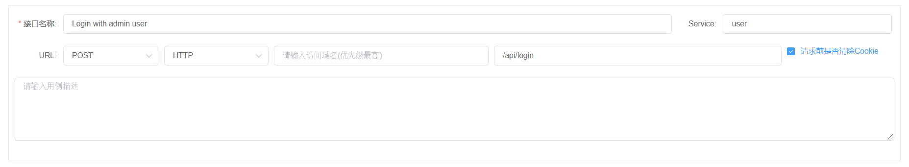

    关于域名Domain字段：Domain字段可为空，如果为空，则执行用例时，接口domain从 测试环境配置中的 domain字段取值。  
        如果Domain字段不为空，则执行时此domain值会覆盖 测试环境配置中的domain字段值。           
    关于Service字段：如果域名domain字段为空，若环境配置中domain字段是否包含参数${service}，则Service字段为必填项。  
        当domain字段为空时，并且环境配置中 domain字段的值 包含 参数 ${service}，则执行时环境配置domain的参数${service}会被替换成接口中的service值。
    关于Route字段：Route支持参数替换，格式为 ${paramName}，参数值来源为 Project全局变量 和 前序接口设置的 用例组变量
##### 4.4.2 数据初始化
数据初始化功能 用于重置测试数据（通过直接操作接口数据库的方式），目前只支持MongoDB 和 MySQL。  
使用数据初始化功能的前提： 在环境配置->DB配置中成功配置DB连接信息，参照[2.2 DB配置管理](#22-db配置管理)

MongoDB

选择DB类型为 MongoDB, 选择DB, 选择方法(Insert One、Update One、Update Many)   
输入 查询条件（Json格式） 和 变更内容（Json格式）  
*注意：引号需使用双引号，支持参数替换，字符串参数类型格式为${strParamName}，数值类型参数格式为$num{numParamName}*
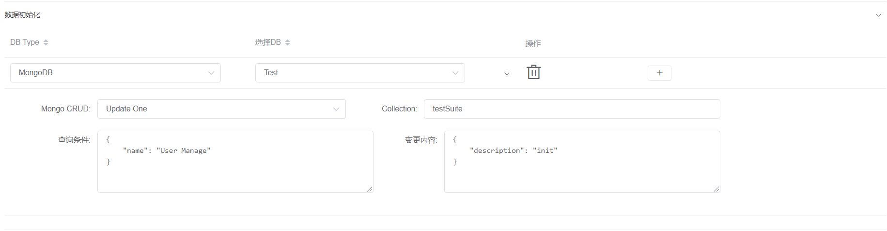

MySQL

选择DB类型为 MySQL, 选择DB, 输入SQL（支持参数替换, 格式为${strParamName})
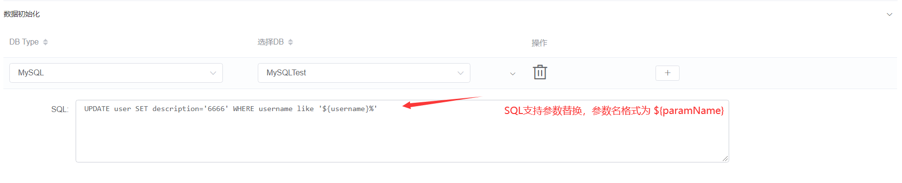
##### 4.4.3 请求头部
可以设置多个Header
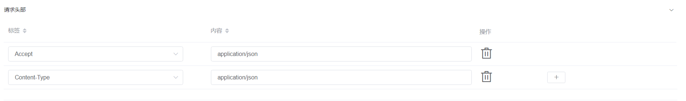
##### 4.4.4 请求参数
请求参数支持 参数替换， 变量格式为 ${paramName}

* GET 请求  
以注册用户为例：
对于GET请求，可直接将请求参数拼接在 路由Route后面, 如 /api/user/register?email=test@leo.com&password=password

也可将参数写到请求参数里，但 需要写成Json格式，比如 Route为: /api/user/register
请求参数为：
    
    {
        "user":"test@leo.com",
        "password":"password"
    }
* POST 请求
对于POST请求，只能将参数写到请求参数里，支持请求参数是Json数组格式，但须勾选 **是否json数组** checkbox  
*请求参数Json需使用双引号*  
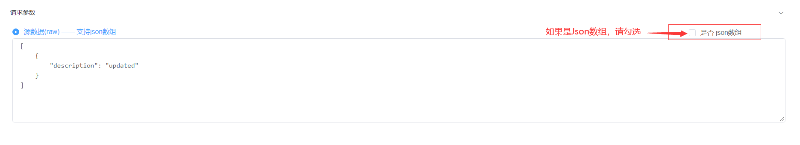
##### 4.4.5 返回结果设置全局变量(用例组级别)
从接口返回Json结果中，取值并赋给设置的用例组变量供后序用例调用，用例组变量的有效范围是当前用例组。  
关于变量查询语句（类似JsonPath)，以如下Json为例：

    {
        "error_code": 0,
        "stu_info": [
                {
                        "id": 2059,
                        "name": "小白",
                        "sex": "男",
                        "age": 28,
                        "addr": "河南省济源市北海大道32号",
                        "grade": "天蝎座",
                        "phone": "18378309272",
                        "gold": 10896,
                        "info":{
                            "card":434345432,
                            "bank_name":'中国银行'
                        }
                },
                {
                        "id": 2067,
                        "name": "小黑",
                        "sex": "男",
                        "age": 28,
                        "addr": "河南省济源市北海大道32号",
                        "grade": "天蝎座",
                        "phone": "12345678915",
                        "gold": 100
                }
        ]
    }
* 获取小白的银行卡号：  stu_info > 0 > info > card
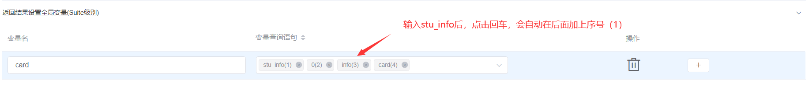
##### 4.4.6 测试结果校验
1. HTTP状态校验
接口返回HTTP状态码校验： 200 - 500
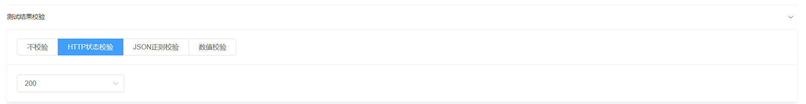
2. JSON返回结果校验
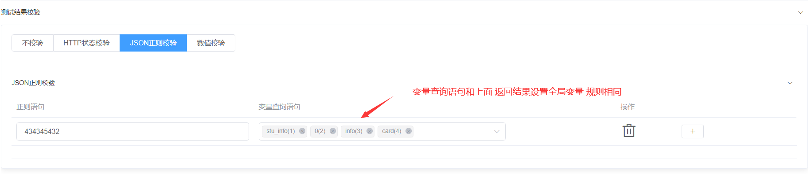
3. 数值校验
数值校验需先将 校验的数值先设置成变量再引用

#### 4.5 全局参数配置
进入项目后，页面默认显示自动化测试Tab，点击上方导航栏 **全局参数配置** 进入参数配置页面  
不同环境，可配置不同的参数值（一般来说，不同环境中的参数个数和参数名相同，参数值不同）
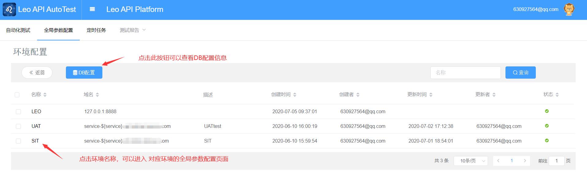
##### 4.5.1 测试环境查看
进入参数配置页面后，默认进入环境配置页面，展示的**环境配置列表**为管理员 配置好的，如需更改环境配置请联系管理员。  
普通用户可以查看环境配置信息，包括：环境名称、域名Domain、描述等。
##### 4.5.2 新增参数
1. 点击**环境名称**进入 **参数配置** 页面
2. 点击上方 **新增参数** 按钮
3. 输入参数名、参数值、描述，点击**提交**按钮，保存
##### 4.5.3 编辑/删除参数
1. 点击**环境名称**进入 **参数配置** 页面, 页面显示参数列表
2. 选择要编辑的 参数， 点击右侧的 **编辑** 按钮，在弹出框中修改信息后，点击提交即可编辑参数
3. 选择要删除的 参数， 点击右侧的 **删除** 按钮，在弹出框中点击**确认**后，即可删除参数
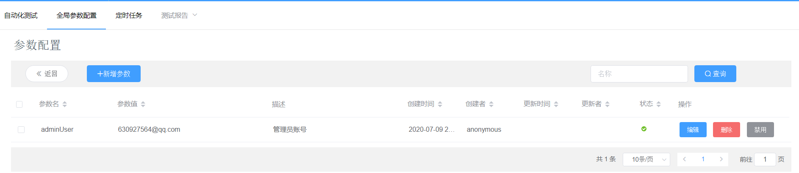
##### 4.5.4 禁用/启用参数
1. 点击**环境名称**进入 **参数配置** 页面, 页面显示参数列表
2. 选择要禁用的 参数，点击右侧 **禁用** 按钮（如果状态为禁用，则按钮为 **启用**），即可禁用/启用 参数
3. *执行接口用例时，无法搜索到 禁用状态的参数*
##### 4.5.5 DB配置查看(数据初始化用)
1. 点击上方导航栏 **全局参数配置** 进入参数配置页面  
2. 点击上方 **DB配置**，进入DB配置列表
3. 选择要查看的 DB配置，点击右侧 **连接信息** 按钮， 进入DB环境连接配置页面
4. 页面会根据配置的测试环境展示DB连接信息
5. 如需更改DB连接信息，请联系管理员进行修改
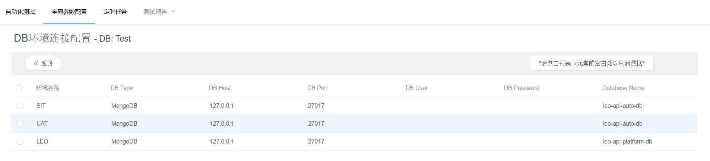

#### 4.6 接口用例执行
此平台接口用例执行有3种方式：   
单个接口用例执行（一般用于新增接口用例调试）、  
接口用例组执行（用于手动选择接口用例组执行）、  
定时任务执行（一般用于回归测试）
##### 4.6.1 单个接口用例调试
1. 当新增接口用例成功后，需要验证用例是否符合期望。
2. 进入用例列表，选择 要调试的接口用例，选择**测试环境**后，点击右侧 **执行按钮**
3. 稍等片刻即可查看测试结果， 点击 **测试结果** 可以查看详情
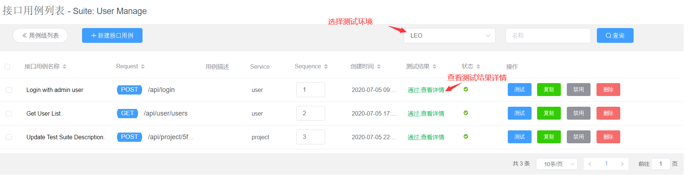
4. 测试详情中，可以查看接口详细信息：包括 替换参数后的 接口信息、请求参数、返回结果、校验结果等
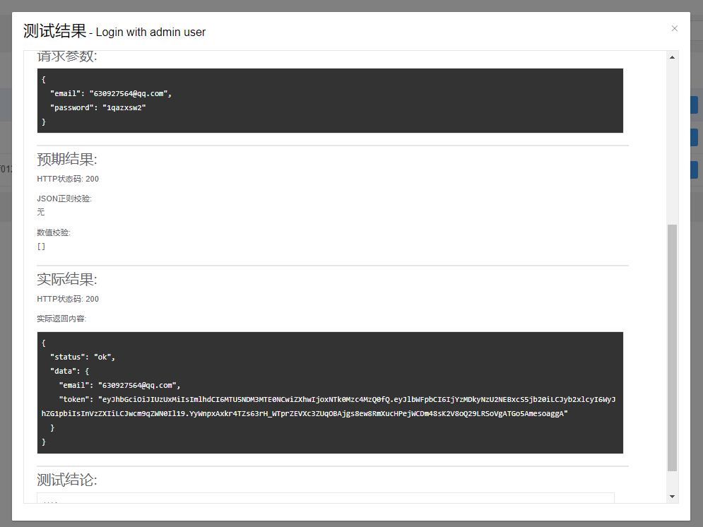

##### 4.6.2 接口用例组执行
1. 进入项目后，选择 **测试环境**，勾选执行的用例组（可多选），点击 上方 **执行测试**按钮
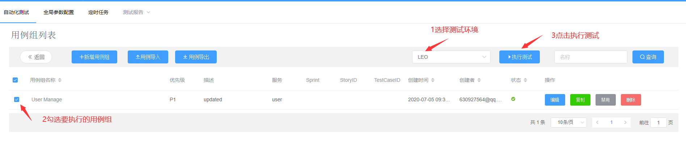
2. 页面提示 *测试已成功启动，请稍后前往「测试报告」查看报告*
3. 稍等片刻，点击 测试报告 -> 手动报告 查看测试结果
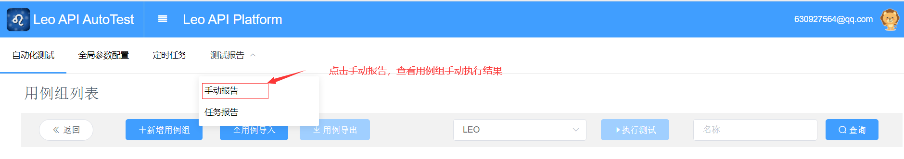
##### 4.6.3 定时任务执行
请参照 [4.7 定时任务](#47-定时任务)
##### 4.6.4 测试报告查看
请参照 [4.8 测试报告](#48-测试报告)

#### 4.7 定时任务
定时任务用于 自动执行测试用例， 在特定的时间(或间隔一段时间)不需要手动触发，就会自动触发执行测试用例。
此平台定时任务包含两种： 具体日期时间执行 和 间隔固定时间执行。

进入项目后，页面默认显示自动化测试Tab，点击上方导航栏 **定时任务** 进入定时任务列表页面  
##### 4.7.1 定时任务新增
1. 进入**定时任务列表**页面，点击上方 **新增定时任务**
2. 输入任务名称、选择 用例组（只能选择当前项目的用例组，*注意：用例组执行顺序为选择先后顺序，先选择的先执行*）、  
   选择测试环境、选择触发类型（具体日期时间/间隔固定时间触发）、  
   如果选择触发间隔则输入间隔时间（单位秒，最小60秒）/如果选择具体日期则选择日期时间（未来的时间）、
   设置 企业微信通知、钉钉通知、邮件组通知（可以设置是否只有当用例执行失败才触发通知）、
   输入任务描述
   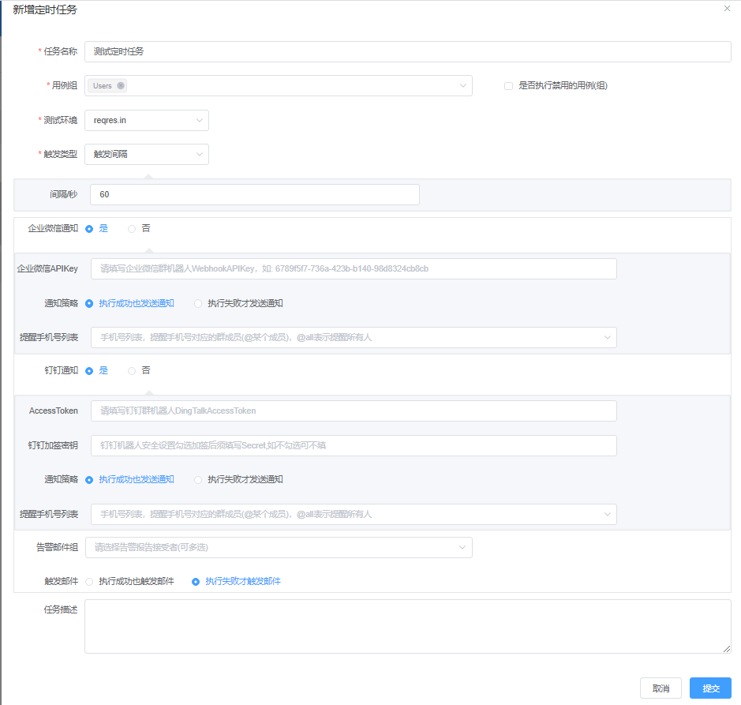
3. 点击 **提交** 按钮，保存定时任务
4. 任务列表会出现刚刚新增的 定时任务，状态默认为启用（如状态为启用，则可以查看next执行时间)
   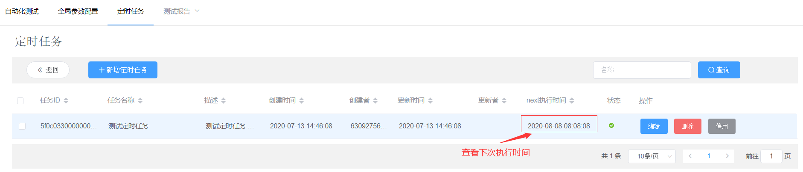
5. 当系统时间到达 next执行时间，会自动触发执行  
   *定时任务执行后，触发类型为：具体日期的定时任务会自动删除，间隔触发的定时任务的next执行时间会自动变为下一次执行时间*
##### 4.7.2 定时任务编辑
1. 进入**定时任务列表**页面，选择要编辑的定时任务，点击 右侧的 **编辑** 按钮
2. 在弹出框中修改信息后，点击提交即可修改定时任务
3. 注意： 对于 间隔触发类型 定时任务，修改后会变更 next执行时间
4. 注意： 编辑定时任务后，定时任务会 自动变成*禁用状态*， 需点击 **启动** 按钮启用
##### 4.7.3 定时任务启动/停用
1. 进入**定时任务列表**页面，选择要停用的定时任务，点击 右侧的 **停用** 按钮即可停用定时任务，
2. 处于停用状态的定时任务 next执行时间为空
3. 如果定时任务处于停用状态，点击右侧 **启动**按钮即可启动此定时任务
4. *注意： 对于间隔触发类型的定时任务，重新启动后 next执行时间=当前时间+触发间隔*
##### 4.7.4 邮件通知
只有定时任务执行后，存在执行失败的测试用例，才会触发邮件通知  
邮件模板：
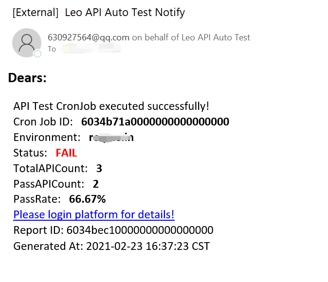
##### 4.7.5 测试报告查看
1. 对于存在失败用例并触发邮件通知的情况，可直接点击 邮件中的链接并登陆后即可查看测试报告
2. 进入项目后，页面默认显示自动化测试Tab，点击上方导航栏 **测试报告**，在下拉框中点击**任务报告** 进入定时任务报告列表页面
3. 点击要查看的报告右侧 **查看详情** 按钮，可查看报告详细信息  

#### 4.8 测试报告
测试报告分为手动报告和定时报告  
手动报告为：手动勾选用例组执行 生成的测试报告， 定时报告为 定时任务执行 生成的测试报告
##### 4.8.1 手动测试报告
1. 进入项目后，点击上方导航栏 **测试报告**，在下拉框中点击**手动报告** 进入手动测试报告列表页面
2. 测试报告列表支持 按照 报告编号、开始时间、执行人、执行用时 排序
3. 选择要查看的测试报告，点击右侧 **查看详情** 按钮，进入 测试报告详细页面
##### 4.8.2 定时任务报告
1. 进入项目后，点击上方导航栏 **测试报告**，在下拉框中点击**任务报告** 进入定时任务报告列表页面
2. 测试报告列表支持 按照 报告编号、开始时间、定时任务、执行用时 排序
3. 选择要查看的测试报告，点击右侧 **查看详情** 按钮，进入 测试报告详细页面
##### 4.8.3 测试报告解读
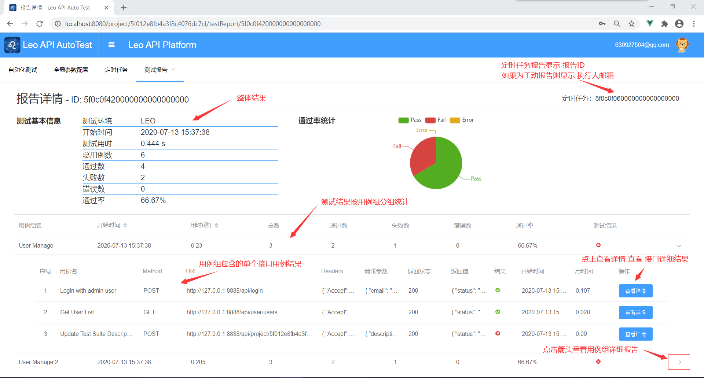
1. 测试报告主要分4个部分：基本信息、通过率统计、用例组分组结果、单个接口详细结果
2. 基本信息 包含 测试环境、执行开始时间、执行用时、用例总数、通过数、失败数以及通过率
3. 通过率统计 以饼图方式 展示 Pass率、失败率
4. 测试结果按照用例组分组展示，每个用例组 单独统计该用例组的 执行开始时间、执行用时、用例总数、通过数、失败数、通过率
5. 点击用例组 右侧箭头，可查看用例组包含的 接口用例详细结果，点击 用例列表右侧 查看详情 按钮可查看单个接口用例执行的详细结果
6. 单个接口用例详细结果包含： 用例名、请求URL、请求方法、执行开始时间、执行用时、数据初始化结果、请求参数、返回结果、测试结论等。
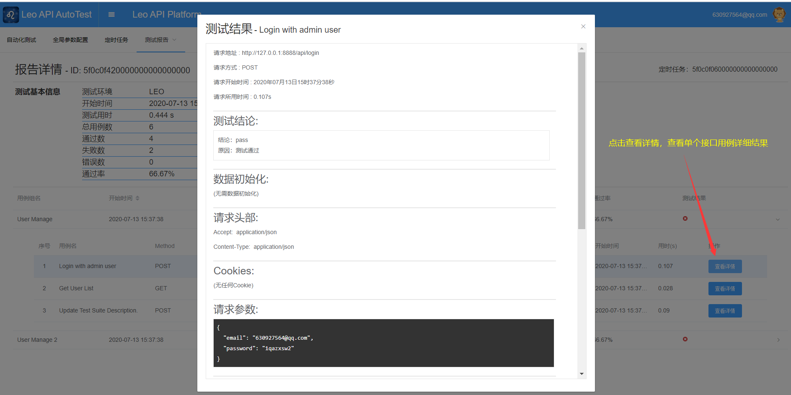