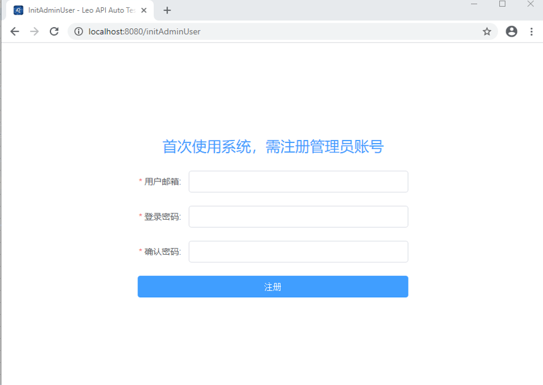
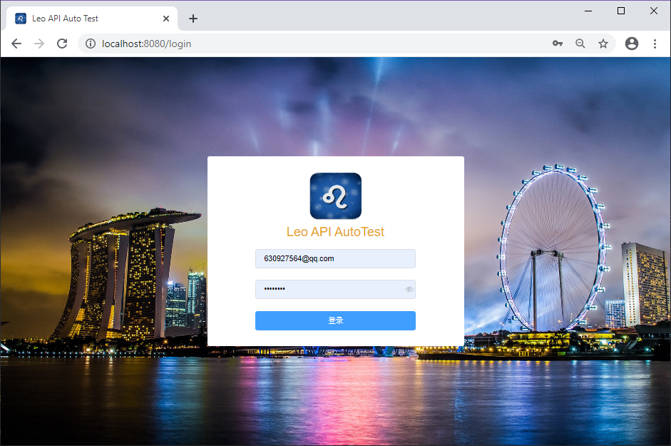

#LEO API测试平台部署

### windows 环境下部署

#### 1. 克隆项目

    git clone https://github.com/Li-Vincent/leo-api-auto.git
如果无法访问github，可使用gitee仓库

    git clone https://git.oschina.net/Li-Vincent/leo-api-auto.git

#### 2. 安装 python 3 环境

[点击进入教程](https://www.runoob.com/python3/python3-install.html)

#### 3. 部署 Mongodb 数据库

[点击进入教程](https://www.runoob.com/mongodb/mongodb-window-install.html)

3.1 需要创建平台所需的MongoDB, 如默认MongoDB Name: leo-api-platform-db

3.2 如果MongoDB配置了安全验证，则需要为平台DB单独添加用户(此为flask_mongoengine限制，不确定是否为bug)

[MongoDB设置用户名和密码](https://www.jianshu.com/p/c5f778adfbb3)

[flask_mongoengine认证问题参照此文档](https://segmentfault.com/q/1010000005769647)

#### 4. 设置系统环境变量

    LEO_API_PLATFORM_ENV=production
    LEO_API_PLATFORM_HOST=${PLATFORM_HOST}
    LEO_API_PLATFORM_PORT=${PLATFORM_PORT}
    LEO_API_PLATFORM_MONGO_HOST=${MONGO_HOST}
    LEO_API_PLATFORM_MONGO_PORT=${MONGO_PORT}
    LEO_API_PLATFORM_MONGO_USERNAME=${USERNAME}
    LEO_API_PLATFORM_MONGO_PASSWORD=${PASSWORD}
    LEO_API_PLATFORM_MONGO_DBNAME=${DBNAME}

说明：LEO_API_PLATFORM_ENV 默认为 production（可不填），

LEO_API_PLATFORM_HOST为平台访问IP，一般为公网IP 或 服务器所在局域网IP, 默认为127.0.0.1（必填）

LEO_API_PLATFORM_PORT为平台访问端口，默认为8888（必填）

LEO_API_PLATFORM_MONGO_HOST 和 LEO_API_PLATFORM_MONGO_PORT 分别表示数据库的地址和端口（必填）

LEO_API_PLATFORM_MONGO_USERNAME 和 LEO_API_PLATFORM_MONGO_PASSWORD 分别表示数据库的帐号密码（若无可不填，如果开启auth，需要注意，此用户必须为admin用户，并开启readWriteAnyDatabase权限）

LEO_API_PLATFORM_MONGO_DBNAME 为默认的数据库DB名（如不填默认为：leo-api-platform-db）

设置完成后可通过下列命令进行测试（CMD切换至项目根目录下）

    python ./backend/config.py
  
若配置成功则可看见输入的配置数据

#### 5. 打包前端 dist 文件（如不需要二次开发，此步骤可跳过，直接执行第6步）

5.1 安装 Vue 环境，下载 node.js 并配置环境

[点击进入node.js教程](https://www.runoob.com/nodejs/nodejs-install-setup.html)

5.2 cmd 进入 frontend 目录下，配置 cnpm :

    npm install -g cnpm --registry=https://registry.npm.taobao.org   
  
5.3 执行安装依赖包命令:

    cnpm install
  
5.4 执行打包命令:

    cnpm run build
  
若成功打包则会在项目根目录下生成 dist 文件夹

#### 6. 启动后端

// 切换至项目根目录下执行

    pip install -r ./backend/requirements_win.txt -i https://pypi.tuna.tsinghua.edu.cn/simple

// 启动后端 ( 默认8888端口 )

    python ./backend/run.py
  
#### 7. 访问项目
现在就可以访问  ${PLATFORM_HOST}:${PLATFORM_PORT}

7.1 创建平台管理员帐号密码

进入${PLATFORM_HOST}:${PLATFORM_PORT}/initAdminUser
进行注册管理员账号，如果db中已经存在管理员账号，此页面无法访问

    
7.2 使用创建的管理员帐号密码进行登录

${PLATFORM_HOST}:${PLATFORM_PORT}/login

### Linux(CentOS7) 环境下 Docker 容器化部署

[点击进入 Docker 教程地址](https://www.runoob.com/docker/ubuntu-docker-install.html)

#### 1. 克隆项目
在机器中选择一个目录，比如/home/leo-api-auto，执行git命令（需提前准备好git服务）

    git clone https://github.com/Li-Vincent/leo-api-auto.git
如果无法访问github，可使用gitee仓库

    git clone https://git.oschina.net/Li-Vincent/leo-api-auto.git
  
#### 2. Mongo 数据库部署 (若已有现成数据库可用则可跳过此步)

2.1 启动数据库 & 数据挂载至宿主机

[点击进入教程地址](https://www.cnblogs.com/vincent-li666/p/12763723.html)
    
2.2 创建数据库帐号

    docker exec -it mongodb /bin/bash

    mongo

    > use admin

    switched to db admin

    # 创建root账号
    > db.createUser({user:"${USERNAME}",pwd:"${PASSWORD}",roles:["root","readWriteAnyDatabase"]})

    Successfully added user: { "user" : ${USERNAME}, "roles" : [ "root", "readWriteAnyDatabase" ] }

    > use leo-api-platform-db

    switched to db leo-api-platform-db

    # 为root账号增加leo-api-platform-db的 readWrite权限
    > db.createUser({ user:"${USERNAME}",pwd:"${PASSWORD}",roles:[{role:"readWrite",db:"leo-api-platform-db"}]})

    Successfully added user: ......

2.3 数据库内存扩容(建议)

    > db.adminCommand({setParameter:1, internalQueryExecMaxBlockingSortBytes:104857600})
    { "was" : 33554432, "ok" : 1 }
  
#### 3. 环境变量配置

// 编辑 /etc/profile 文件

    sudo -i
    vim /etc/profile
  
若出现警告则选择 (E)dit anyway (输入 E)

3.1 文本末端插入下列数据 (输入 i 则变为 insert 状态)

    export LEO_API_PLATFORM_ENV=production
    export LEO_API_PLATFORM_HOST=${PLATFORM_HOST}
    export LEO_API_PLATFORM_PORT=${PLATFORM_PORT}
    export LEO_API_PLATFORM_MONGO_HOST=${MONGO_HOST}
    export LEO_API_PLATFORM_MONGO_PORT=${MONGO_PORT}
    export LEO_API_PLATFORM_MONGO_USERNAME=${USERNAME}
    export LEO_API_PLATFORM_MONGO_PASSWORD=${PASSWORD}
    export LEO_API_PLATFORM_MONGO_DBNAME=${DBNAME}
    
说明：LEO_API_PLATFORM_ENV 默认为 production（可不填）

LEO_API_PLATFORM_HOST为平台访问IP，一般为公网IP 或 服务器所在局域网IP（必填）

LEO_API_PLATFORM_PORT为平台访问端口，默认为8888，如果为阿里云等服务器，需要开放该端口（必填）

LEO_API_PLATFORM_MONGO_HOST 和 LEO_API_PLATFORM_MONGO_PORT 分别表示数据库的地址和端口（必填,一般为部署mongodb的服务器局域网/公网IP和指定的端口）

**踩坑记录**
> 如果MongoDB和平台部署在同一台服务器里，Mongo_HOST 不可使用127.0.0.1, 应该使用docker宿主机IP。  
> 在机器中 执行 ifconfig 查看宿主机IP，一般为： 172.18.0.1 或 172.17.0.1

LEO_API_PLATFORM_MONGO_USERNAME 和 LEO_API_PLATFORM_MONGO_PASSWORD 分别表示数据库的帐号密码（若无可不填，如果开启auth，需要注意，此用户必须为admin用户，并开启readWriteAnyDatabase权限）

LEO_API_PLATFORM_MONGO_DBNAME 为默认的数据库DB名（如不填默认为：leo-api-auto-db，需要先在mongodb中手动创建数据库，database name = DBNAME）

3.2 插入完毕后点击 ESC 按钮、输入 :wq 后单击回车保存

3.3 执行下列命令后环境变量立即生效

    source /etc/profile
  
#### 4. 启动项目

在项目根目录下执行部署文件,预计需要等待几分钟（取决于网速和机器性能），即可部署完成

    sh DeployService

**踩坑记录**
> 如果账号没有root权限，需要加 sudo的话， 记得加 sudo -E sh DeployService， 不然无法获取全局变量

#### 5. 访问项目

浏览器访问${PLATFORM_HOST}:${PLATFORM_PORT}即可

首先需要创建管理员账号，访问  ${PLATFORM_HOST}:${PLATFORM_PORT}/initAdminUser

   
创建账户后访问登录页面， ${PLATFORM_HOST}:${PLATFORM_PORT}/login

