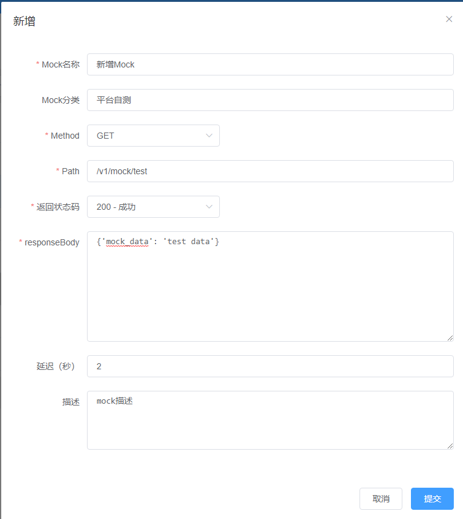
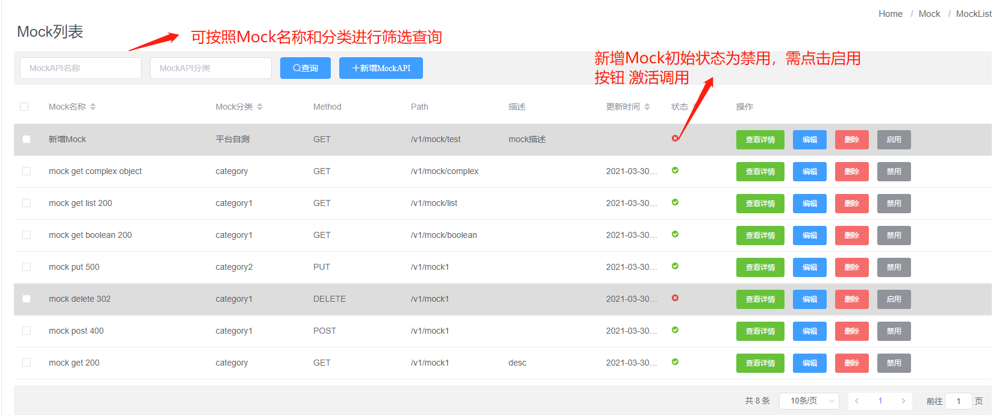
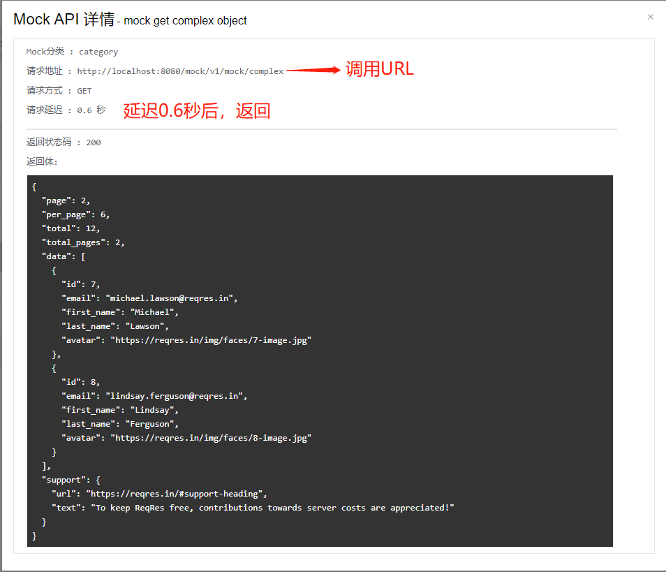
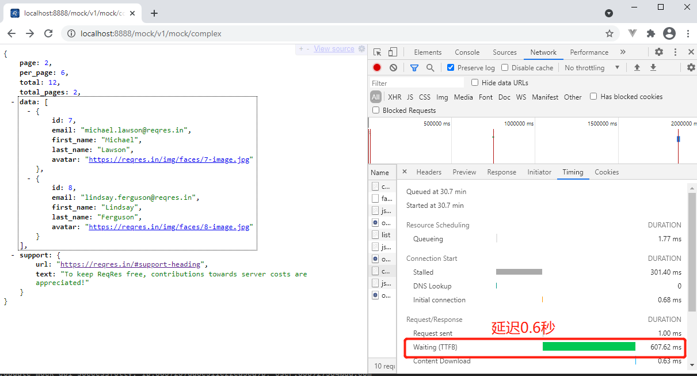

### 6_MOCK数据
MOCK数据模块用于在测试过程中，对于某些不容易构造或者不容易获取的对象，用一个虚拟的对象来创建以便测试的测试方法，有助于从测试中消除依赖项，使测试更单元化。 

#### 6.1 MOCK数据管理
只有超级管理员 和 项目管理员 有**MOCK管理**权限。  
管理员账号登录后，点击左侧 Menu **Mock数据** 进入Mock列表页面

##### 6.1.1 新增MockAPI
1. 进入 **Mock数据** 页面后，页面会展示 Mock列表
2. 点击 列表上方 **+新增MockAPI** 按钮
3. 输入 Mock名称、分类、Method、Path、返回状态码、返回体、延迟、描述
   
4. 点击 **提交** 新增Mock
5. 新增的MockAPI初始状态为 *禁用* 状态， 需点击 **启用** 按钮后，才能激活调用

##### 6.1.2 编辑MockAPI
1. 进入 **Mock数据** 页面后，页面会展示 Mock列表
2. 可以按照 Mock名称和分类进行筛选查询
   
3. 点击要编辑的Mock右侧的 **编辑** 按钮 进行编辑
4. 输入要编辑的内容后 点击 **提交** 编辑MockAPI

#### 6.2 MOCK API的调用
1. 进入 **Mock数据** 页面后，页面会展示 Mock列表
2. 点击要查看的MockAPI右侧的 **查看详情** 按钮，页面会展示Mock详细
   
3. 访问 请求地址， 按照请求方式进行调用
4. Mock服务器会按照设置的返回体和延迟时间进行返回
   
