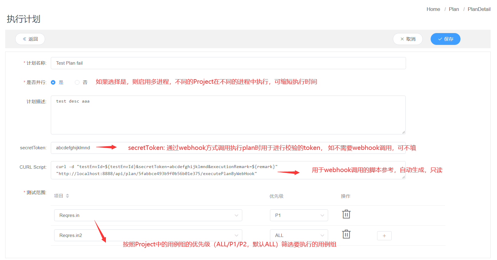
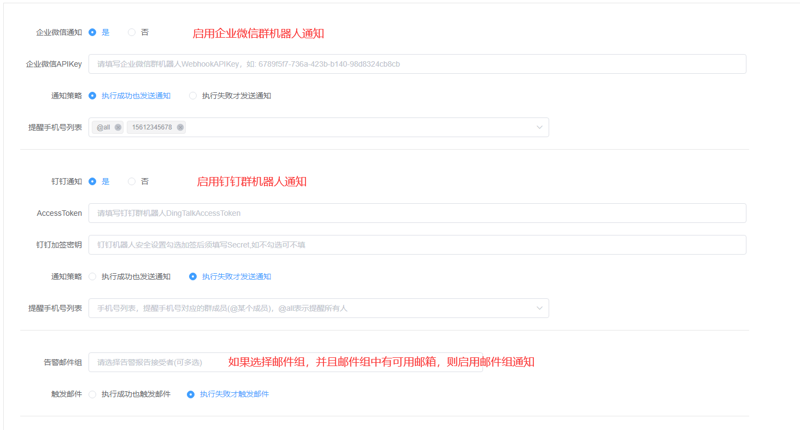
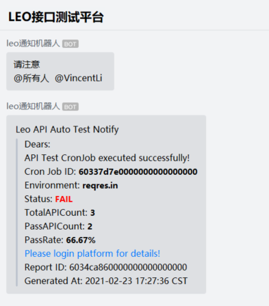
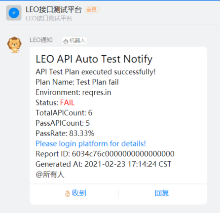
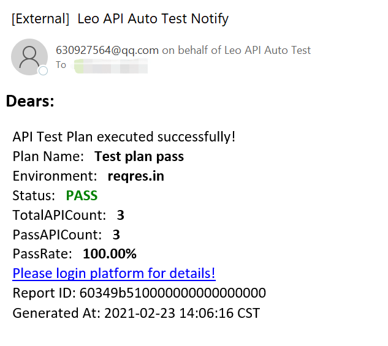
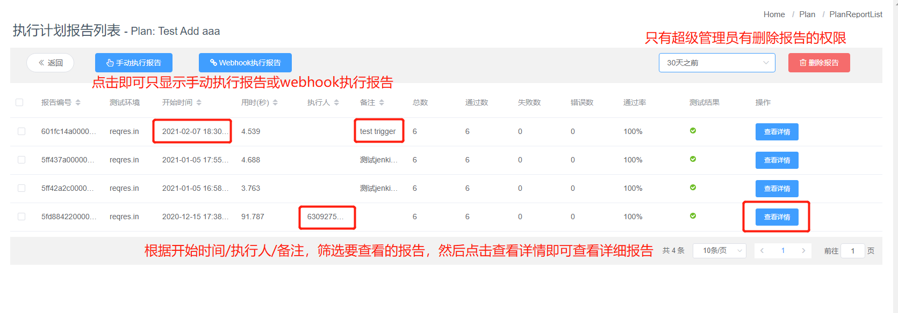
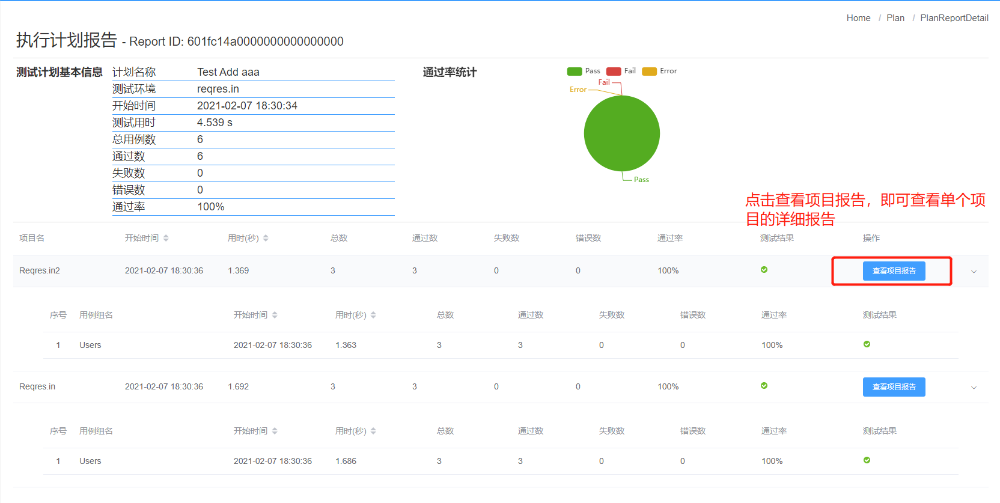
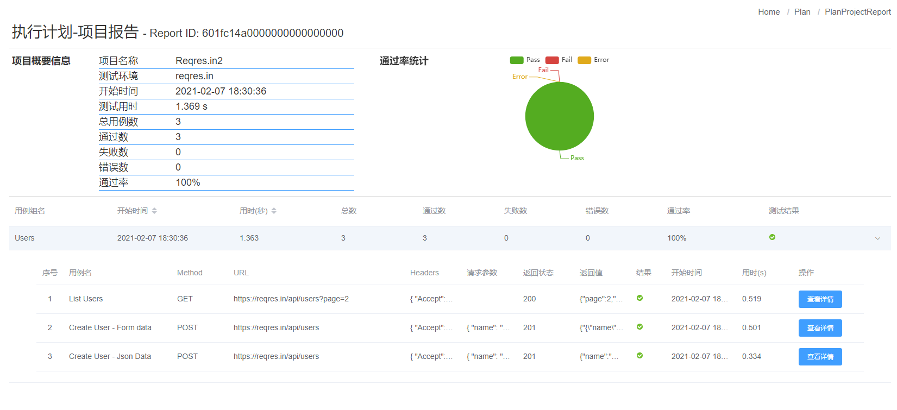

### 5_执行计划
执行计划用于设置跨项目执行，根据项目中的用例组优先级筛选要执行的用例组

可以通过手动触发执行，也可以通过远程POST调用执行（实现持续集成）。

#### 5.1 执行计划管理
只有超级管理员 和 项目管理员 有**项目管理**权限。  
管理员账号登录后，点击左侧 Menu **执行计划** 进入执行计划页面
##### 5.1.1 新增计划
1. 进入**执行计划**页面后，点击 **新增计划**  
2. 输入 计划 名称、版本号、描述 信息，并选择是否并行执行
3. 点击 **提交** 保存计划信息，刚刚新增的计划处于禁用状态，需 完善计划内容后才可启用
##### 5.1.2 编辑计划
1. 进入 **执行计划** 页面后，页面会展示 计划列表
2. 可以在页面左上角 进行查询，查询条件为 计划名称，支持模糊查询
3. 选择要编辑的 执行计划，点击左侧 **计划名称** 进入编辑页面
4. 输入 要修改的 计划信息
    
5. 设置通知策略，可设置企业微信通知、钉钉通知、邮件组通知
    
6. 点击 **提交** 保存 执行计划
##### 5.1.3 删除计划
1. 进入 **执行计划** 页面后，页面会展示 计划列表
2. 可以在页面左上角 进行查询，查询条件为 计划名称，支持模糊查询
3. 选择要编辑的 计划，点击右侧 **删除** 按钮
4. 点击 弹出框的 **确认** 按钮， 删除计划
5. *误操作删除计划可以找管理员直接修改DB，找回项目*
##### 5.1.4 禁用/启用计划
1. 进入 **执行计划** 页面后，页面会展示 计划列表
2. 可以在页面左上角 进行查询，查询条件为 计划名称，支持模糊查询
3. 选择要禁用的 计划，点击右侧 **禁用** 按钮（如果状态为禁用，则按钮为 **启用**），即可禁用/启用 计划

#### 5.2 计划执行
##### 5.2.1 手动执行
1. 进入 **执行计划** 页面后，页面会展示 计划列表
2. 勾选 要执行的计划，选择执行环境，点击 **执行** 按钮
3. 等待片刻，即可点击 **查看报告** 查看执行报告
4. 企业微信群通知模板    

5. 钉钉群通知模板

6. 邮件通知模板

##### 5.2.2 通过Webhook执行
1. 进入 **执行计划** 页面后，页面会展示 计划列表
2. 点击 要执行的 **计划名称** 进入计划详情
3. 复制 CURL Script 后的内容，并将信息补全（ testEnvId请进入环境配置查询ID，remark为自定义标记,可填入jenkins job name）
4. 将补全的curl Script 填入jenkins job - Build - Execute Shell中即可通过jenkins trigger执行plan，注意:curl脚本不能换行
5. 也可以通过HTTP Post调用执行计划

##### 5.2.3 查看报告
1. 进入 **执行计划** 页面后，页面会展示 计划列表
2. 选择要查看的计划，点击右侧 **查看报告** 查看执行报告
3. 进入执行计划报告列表后，可以点击**手动执行报告** 或 **webhook执行报告** 来筛选报告
4. 根据**执行时间**以及**执行人/备注** 找到要查看的报告，点击右侧**查看详情** 可查看报告详情

5. 执行计划报告分为两层，一层为按照项目统计执行结果，点击 **查看项目报告** 可查看项目详细报告

6. 项目详细报告按照用例组统计结果
